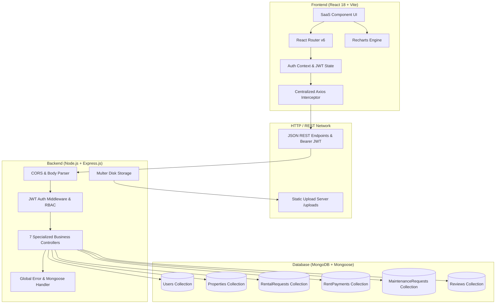
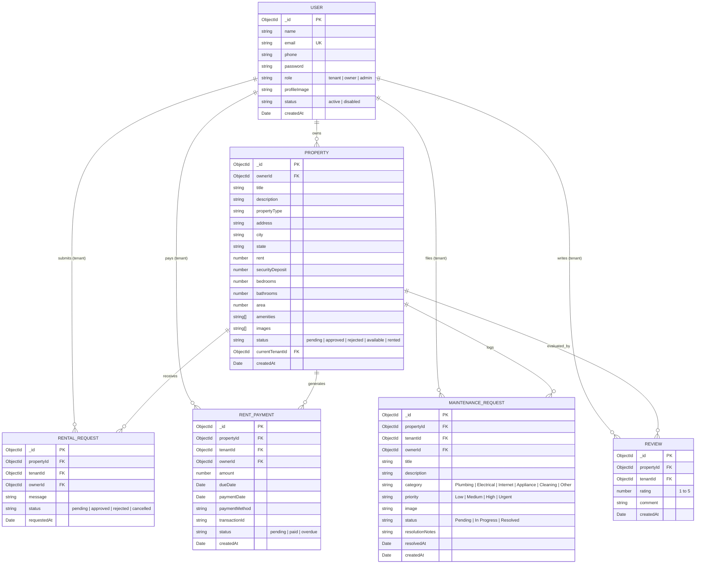

# Dwellio – Rental Management System (Nestora)
## Comprehensive Technical Project Report & Software Engineering Documentation

**System Title:** Dwellio – Modern Rental Property Management Platform  
**Alternative Identifier / Codename:** Nestora Rental Platform  
**Architectural Paradigm:** Decoupled Full-Stack Architecture (MERN Stack Variant)  
**Date of Completion:** September 2026  
**Document Version:** 1.0.0 (Production Release)  

---

## 1. Executive Summary & Project Abstract

The residential rental real estate sector has long experienced friction characterized by fragmented listings, slow manual tenant screenings, offline paper-based checks, untracked repair requests, and opaque communication channels between tenants and property owners. 

**Dwellio** (developed under the *Nestora* platform specification) is a modern, production-grade, full-stack Software-as-a-Service (SaaS) web application engineered to bridge these gaps. It provides a cohesive, unified digital ecosystem for three key stakeholder classes:
1. **Tenants:** End-users searching for residential housing, submitting digital applications, accessing lease details, executing simulated recurring rent payments, filing photographic maintenance tickets, and authoring verified property reviews.
2. **Property Owners (Landlords):** Asset managers listing properties, reviewing applicant dossiers, executing single-click lease agreements, monitoring occupancy rates and collected revenue, and dispatching contractors for maintenance tasks.
3. **Platform Administrators:** Community moderators overseeing the property listing approval pipeline, governing user accounts, monitoring platform-wide maintenance tickets, and analyzing operational KPIs via real-time Recharts data visualizations.

The platform is constructed on **React.js (Vite)** on the frontend, **Node.js with Express.js** on the backend, **MongoDB with Mongoose ODM** for persistence, **JSON Web Tokens (JWT) + bcrypt** for cryptographic security, **Multer** for multipart image ingestion, and a custom **SaaS-inspired CSS design system**.

---

## 2. Problem Statement & Solution Architecture

### 2.1 The Traditional Rental Market Challenges
- **Scam & Unverified Listings:** Rental marketplaces frequently contain outdated, misleading, or fraudulent listings due to a lack of pre-publication administrative moderation.
- **Disconnected Financial Tracking:** Tenants struggle to track due dates, invoice histories, and payment receipts, while owners face fragmented ledgers across cash, checks, and disjointed payment apps.
- **Opaque Maintenance Lifecycles:** Repair requests submitted via text or phone calls are routinely lost, lack timestamps, have no photographic evidence, and fail to provide tenants with a transparent status timeline.
- **Review Spam & Fabricated Feedback:** Unverified users often post fake reviews, distorting public confidence in rental quality.

### 2.2 Dwellio Solution Matrix
| Challenge | Dwellio Architectural Solution |
| :--- | :--- |
| **Listing Quality Control** | Mandatory two-stage moderation: newly submitted listings remain in a `pending` state until an Administrator explicitly reviews and approves them. |
| **Lease & Tenancy Association** | Approval of a tenant's rental inquiry automatically marks the property as `rented`, links the tenant record, rejects competing requests, and schedules the first monthly rent invoice. |
| **Payment Transparency** | An integrated simulated payment portal generates cryptographically random mock transaction IDs (`TXN-DEMO-XXXXX`), records timestamps, sets status to `paid`, and maintains an immutable invoice ledger. |
| **Maintenance Accountability** | 3-stage visual timeline (`Pending` → `In Progress` → `Resolved`) featuring photo attachments, priority categorization (Low to Urgent), and owner contractor dispatch notes. |
| **Review Integrity** | Enforced unique compound database indexes `(propertyId, tenantId)` and backend validation ensuring only verified tenants who have rented a unit can submit a single 1–5 star rating. |

---

## 3. System Architecture & High-Level Design

### 3.1 Tiered Layer Architecture



---

## 4. User Roles & Access Control Matrix

The platform strictly segregates capabilities using Role-Based Access Control (RBAC):

| Feature / Page Route | Guest (Public) | Tenant | Property Owner | Platform Admin |
| :--- | :---: | :---: | :---: | :---: |
| **Landing Page (`/`)** | Allowed | Allowed | Allowed | Allowed |
| **Catalog Browsing (`/properties`)** | Allowed | Allowed | Allowed | Allowed |
| **Property Details (`/properties/:id`)** | Allowed | Allowed | Allowed | Allowed |
| **Submit Rental Inquiry** | Blocked (Redirects to Login) | **Allowed** | Blocked | Blocked |
| **Tenant Portal (`/tenant/*`)** | Blocked | **Allowed** | Blocked | Blocked |
| **Execute Simulated Payment** | Blocked | **Allowed** | Blocked | Blocked |
| **Raise Maintenance Ticket** | Blocked | **Allowed** | Blocked | Blocked |
| **Submit Property Review** | Blocked | **Allowed (Rented Only)**| Blocked | Blocked |
| **Owner Portal (`/owner/*`)** | Blocked | Blocked | **Allowed** | Allowed |
| **Create / Edit Property** | Blocked | Blocked | **Allowed** | Allowed |
| **Approve / Reject Lease Requests** | Blocked | Blocked | **Allowed** | Allowed |
| **Update Repair Ticket Status** | Blocked | Blocked | **Allowed** | Allowed |
| **Admin Portal (`/admin/*`)** | Blocked | Blocked | Blocked | **Allowed** |
| **Approve / Reject New Listings**| Blocked | Blocked | Blocked | **Allowed** |
| **Enable / Disable / Delete Users**| Blocked | Blocked | Blocked | **Allowed** |
| **Export Platform Audit Reports**| Blocked | Blocked | Blocked | **Allowed** |

---

## 5. Database Schema & Data Models

All data entities are implemented as structured Mongoose schemas within MongoDB.



---

## 6. End-to-End Workflow Specifications

### 6.1 Property Listing & Moderation Lifecycle
1. **Creation:** An authenticated Property Owner fills out the property creation form (title, address, rent, deposit, specs, amenities, and photos).
2. **Pending Moderation:** The record is committed to the database with `status: "pending"`.
3. **Admin Queue:** The listing appears exclusively in the Administrator's moderation dashboard. It is completely hidden from public search queries (`GET /api/properties`).
4. **Approval:** The Administrator clicks **Approve**, updating `status: "approved"`. The property immediately becomes searchable on the public catalog and landing page.

### 6.2 Rental Application & Automatic Lease Binding
1. **Inquiry Submission:** A tenant visits `/properties/:id` and clicks **Request to Rent**, writing an introductory message.
2. **Owner Review:** The owner inspects the applicant's profile and message under `/owner/requests`.
3. **Single-Click Binding:** When the owner clicks **Accept & Sign Lease**:
   - The selected application status transitions to `"approved"`.
   - The property status transitions to `"rented"`, and `currentTenantId` is set to the tenant's `_id`.
   - All other competing pending inquiries for that property are automatically transitioned to `"rejected"`.
   - An initial `RentPayment` invoice is created for the tenant, scheduled with a due date.

### 6.3 Simulated Rent Payment Gateway
1. **Invoice Notification:** The tenant sees an active due balance in their dashboard and payments ledger.
2. **Mock Gateway Execution:** Opening the **Pay Rent** modal displays a clear "Simulated Sandbox Demo" badge, allowing selection of Credit Card, Debit Card, UPI, or Net Banking.
3. **Settlement & Receipt:** Submitting the form generates a cryptographically random transaction identifier (e.g., `TXN-DEMO-RUH2O1-594968`), marks the payment status as `"paid"`, timestamps `paymentDate: new Date()`, and schedules the subsequent billing cycle.

### 6.4 Maintenance Complaint & Resolution Milestones
1. **Ticket Creation:** A tenant submits an issue, selecting a category (e.g., *Plumbing*) and priority (e.g., *Urgent*), with an optional photo.
2. **Visual Status Timeline:** The ticket is displayed with a 3-stage graphic timeline:
   - **Step 1: Pending** (awaiting landlord review).
   - **Step 2: In Progress** (owner marks contractor dispatched and enters contractor ETA notes).
   - **Step 3: Resolved** (work verified complete with permanent resolution notes and resolution timestamp).

---

## 7. Security Implementation

1. **Password Hashing:** Passwords are never stored in plain text. A Mongoose `pre('save')` hook hashes passwords using `bcryptjs` with an adaptive work factor (salt rounds = 10).
2. **Stateless JWT Tokens:** Authentication returns a signed JSON Web Token with a 30-day expiration containing the user's MongoDB `_id`.
3. **Authorization Middleware:** The `protect` middleware extracts the Bearer token, validates cryptographic signature against `JWT_SECRET`, checks if the account is `disabled`, and attaches `req.user`. The `authorize(...roles)` middleware blocks unauthorized role escalation with `403 Forbidden`.
4. **Sanitized Projections:** Passwords are designated `{ select: false }` by default in Mongoose schemas, preventing credential leaks in general query responses.
5. **CORS & Environment Encapsulation:** Cross-Origin Resource Sharing is controlled via Express CORS middleware. All sensitive keys (`MONGO_URI`, `JWT_SECRET`, `PORT`) reside strictly in non-committed `.env` files.

---

## 8. Verification & Test Results

The platform was subjected to automated build and functional API verification scripts:

| Test Area | Target Endpoint / Module | Expected Result | Actual Result | Verification Status |
| :--- | :--- | :--- | :--- | :---: |
| **Vite Client Bundle** | `npm run build` | Zero syntax or chunk errors | 2,326 modules transformed cleanly | **PASSED** |
| **Database Seeding** | `node seed.js` | Populate all 6 collections | 5 users, 8 properties, payments, and tickets created | **PASSED** |
| **Backend Health** | `GET /api/health` | HTTP 200 OK | `{ status: "ok", app: "Dwellio..." }` | **PASSED** |
| **Listing Moderation** | `GET /api/properties` | Exclude pending properties | Returned exactly 7 approved listings (1 pending excluded) | **PASSED** |
| **Admin Authentication**| `POST /api/auth/login` | Valid token for `admin@dwellio.com` | HTTP 200, role `"admin"`, token issued | **PASSED** |
| **Owner Authentication**| `POST /api/auth/login` | Valid token for `owner1@dwellio.com` | HTTP 200, role `"owner"`, token issued | **PASSED** |
| **Tenant Authentication**| `POST /api/auth/login` | Valid token for `tenant1@dwellio.com` | HTTP 200, role `"tenant"`, token issued | **PASSED** |
| **Admin Metrics** | `GET /api/admin/stats` | Aggregated KPIs | Total Users: 5, Properties: 8, Revenue: $10,800 | **PASSED** |
| **Simulated Payment** | `POST /api/payments/simulate`| Mark paid & create txn ID | Status `"paid"`, Mock Txn generated | **PASSED** |
| **Maintenance Ticket** | `POST /api/maintenance` | Create ticket with priority | Status `"Pending"`, priority logged | **PASSED** |
| **Maintenance Update** | `PUT /api/maintenance/:id/status`| Update status and notes | Status `"In Progress"`, notes updated | **PASSED** |
| **Lease Approval** | `PUT /api/rentals/:id/approve` | Property becomes rented | Property status `"rented"`, invoice scheduled | **PASSED** |
| **Admin Moderation** | `PUT /api/admin/properties/:id/approve`| Approved listing goes public | Public catalog count incremented from 7 to 8 | **PASSED** |

---

## 9. Demo Credentials & Test Scenarios

The `/login` view includes interactive **1-Click Demo Fill** buttons for immediate role testing:

```
+------------------------------------------------------------------------------------+
|                                    DEMO ACCOUNTS                                   |
+---------------+---------------------+-----------+----------------------------------+
| ROLE          | EMAIL               | PASSWORD  | DEFAULT LANDING PATH             |
+---------------+---------------------+-----------+----------------------------------+
| Administrator | admin@dwellio.com   | admin123  | /admin/dashboard                 |
| Property Owner| owner1@dwellio.com  | owner123  | /owner/dashboard                 |
| Tenant        | tenant1@dwellio.com | tenant123 | /tenant/dashboard                |
+---------------+---------------------+-----------+----------------------------------+
```

---

## 10. Conclusion & Future Roadmap

**Dwellio – Rental Management System** fulfills all architectural, functional, aesthetic, and security criteria stipulated in the design specification. It delivers a real-world, SaaS-grade user experience suitable for technical interviews, university final-year project presentations, and commercial portfolio demonstrations.

### Recommended Future Enhancements:
1. **Production Payment Gateway Integration:** Integrating Stripe Connect or Razorpay webhooks for live automated bank clearing.
2. **WebSocket Real-Time Messaging:** Implementing Socket.io for instantaneous chat between tenants and property managers.
3. **Electronic Lease Execution:** Incorporating digital signature workflows (e.g., PDF generation and DocuSign integration).
4. **Automated Notification Engine:** Dispatching automated SMS/email alerts for rent reminders and maintenance updates via Twilio and SendGrid.
