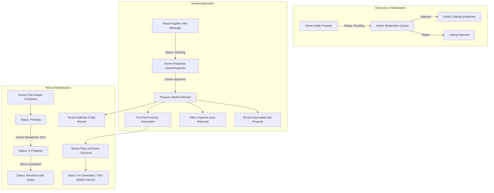

# Dwellio – Modern Rental Property Management System (Nestora)

[](https://react.dev/)
[](https://nodejs.org/)
[](https://www.mongodb.com/)
[](https://jwt.io/)
[](https://recharts.org/)

**Dwellio** (powered by *Nestora Rental Management System*) is a modern, production-style, full-stack rental property management web application designed to seamlessly connect **Tenants**, **Property Owners**, and **Platform Administrators**.

The application features a responsive SaaS interface with role-based routing, real-time analytics dashboards, simulated digital rent payment processing, multi-step maintenance ticket tracking with timelines, property moderation workflows, and tenant review management.

---

## Table of Contents

1. [Key Features by Role](#key-features-by-role)
2. [Technology Stack](#technology-stack)
3. [System Architecture & Folder Structure](#system-architecture--folder-structure)
4. [User Roles & Access Control](#user-roles--access-control)
5. [Demo Credentials](#demo-credentials)
6. [Prerequisites & MongoDB Setup](#prerequisites--mongodb-setup)
7. [Installation & Quick Start](#installation--quick-start)
8. [Environment Variables](#environment-variables)
9. [REST API Documentation](#rest-api-documentation)
10. [Key Application Workflows](#key-application-workflows)
11. [Future Enhancements](#future-enhancements)

---

## Key Features by Role

### 1. Tenants
- **Public & Authenticated Discovery**: Browse verified properties, search by keyword, city, rent range, bedroom/bathroom count, and filter by 10+ amenities.
- **Rental Applications**: Submit digital lease applications directly to landlords with customized introductory messages and track application status (`pending`, `approved`, `rejected`, `cancelled`).
- **Active Tenancy Portal**: View current occupied residence, monthly rent, deposit held, lease terms, and landlord contact details.
- **Simulated Rent Payments**: Dedicated payment portal with simulated card / instant transfer checkout, generating unique mock transaction IDs (e.g. `TXN-DEMO-XXXXX`), marking rent as `paid`, updating next due dates, and generating receipts.
- **Maintenance & Repair Tickets**: Raise maintenance complaints with issue category (Plumbing, Electrical, Internet, Appliance, Cleaning, Other), priority level (Low, Medium, High, Urgent), and photo attachments. Track progress on an interactive visual timeline (`Pending` → `In Progress` → `Resolved`).
- **Property Reviews**: Submit 1–5 star ratings and reviews for rented properties. Duplicate submissions by the same tenant are automatically prevented.
- **Profile Management**: Update name, phone, profile photo, and password.

### 2. Property Owners
- **Owner Analytics Dashboard**: Real-time overview cards (Total Properties, Available Units, Rented Units, Pending Applications, Monthly Potential Income) and interactive Recharts revenue graphs.
- **Property Management**: Add new properties with address, specifications, pricing, amenities checklist, and multiple image uploads (via Multer). Edit existing listings, toggle availability between `available` and `rented`, or delete properties.
- **Rental Application Review**: Review incoming tenant applications, read tenant messages, and approve or decline requests. Upon approval, the property automatically transitions to `rented`, the tenant is linked, other pending requests are rejected, and the first rent billing invoice is scheduled.
- **Tenant & Payment Tracking**: Directory of active residents and complete payment transaction ledger with breakdown of paid, pending, and overdue rents.
- **Maintenance Operations**: View tenant maintenance complaints, dispatch technicians, update workflow status, and log resolution notes.

### 3. Platform Administrators
- **Executive Oversight Dashboard**: High-level platform KPIs (Total Users, Tenants, Owners, Properties, Pending Moderation, Leased Units, Gross Platform Revenue, Open Complaints).
- **Interactive Recharts Visualizations**:
  - Monthly Platform Rental Revenue (Area Chart)
  - User Role Distribution (Donut Chart)
  - Property Portfolio by Type (Pie Chart)
  - Rental Application Volume by Status (Bar Chart)
- **User Management**: Search user directory by name, email, or phone; filter by role and account status; toggle account status (`active` ↔ `disabled`); delete accounts.
- **Property Moderation Queue**: Review submitted listings before they go public (`pending` → `approved` / `rejected`). Only approved properties display on public catalogs. Delete inappropriate listings.
- **Network Inquiries & Maintenance Oversight**: Global audit of all rental requests and repair tickets across the ecosystem.
- **Exportable Audit Reports**: One-click JSON export of operational metrics and platform health diagnostics.

---

## Technology Stack

| Layer | Technologies Used |
| :--- | :--- |
| **Frontend** | React 18, React Router v6, Axios, Lucide React (Icons), Recharts, Vite |
| **Backend** | Node.js, Express.js (REST API, CORS, static upload server) |
| **Database** | MongoDB with Mongoose ODM (Schemas, validation, hooks, compound indexes) |
| **Security** | JWT (JSON Web Tokens), bcryptjs password hashing, role-based authorization |
| **File Handling** | Multer disk storage for property and maintenance photo uploads |
| **Styling** | Modern CSS Design System (Custom variables, glassmorphism, responsive grids) |

---

## System Architecture & Folder Structure

```
Rental Management System/
├── package.json                 # Root convenience scripts
├── README.md                    # Project documentation & demo credentials
│
├── server/                      # Node.js + Express.js Backend
│   ├── config/
│   │   └── db.js                # MongoDB Mongoose connection
│   ├── controllers/
│   │   ├── authController.js    # Register, login, getMe, updateProfile
│   │   ├── propertyController.js# Property catalog, search, filter, CRUD
│   │   ├── rentalController.js  # Rental applications & approvals
│   │   ├── paymentController.js # Simulated rent payments & ledgers
│   │   ├── maintenanceController.js # Maintenance tickets & status updates
│   │   ├── reviewController.js  # Ratings & reviews
│   │   └── adminController.js   # Analytics, user & property moderation
│   ├── middleware/
│   │   ├── authMiddleware.js    # JWT protect & authorize(...roles)
│   │   ├── uploadMiddleware.js  # Multer diskStorage configuration
│   │   └── errorMiddleware.js   # 404 handler & Mongoose error formatting
│   ├── models/
│   │   ├── User.js              # User schema with bcrypt pre-save hook
│   │   ├── Property.js          # Property schema with owner ref & amenities
│   │   ├── RentalRequest.js     # Request schema with status workflow
│   │   ├── RentPayment.js       # Payment invoice schema with mock txn IDs
│   │   ├── MaintenanceRequest.js# Maintenance schema with timeline notes
│   │   └── Review.js            # Review schema with unique compound index
│   ├── routes/
│   │   ├── authRoutes.js        # /api/auth
│   │   ├── propertyRoutes.js    # /api/properties
│   │   ├── rentalRoutes.js      # /api/rentals
│   │   ├── paymentRoutes.js     # /api/payments
│   │   ├── maintenanceRoutes.js # /api/maintenance
│   │   ├── reviewRoutes.js      # /api/reviews
│   │   └── adminRoutes.js       # /api/admin
│   ├── uploads/                 # Storage destination for uploaded images
│   ├── seed.js                  # Database seed script with sample data
│   ├── server.js                # Main Express server entrypoint
│   ├── package.json
│   └── .env                     # Backend environment variables
│
└── client/                      # React.js + Vite Frontend
    ├── src/
    │   ├── assets/              # Icons, placeholders
    │   ├── components/
    │   │   ├── common/          # Navbar, Footer, Sidebar, Modal, Badge, Loader, EmptyState, StarRating, StatCard
    │   │   ├── property/        # PropertyCard, PropertyFilter, ImageGallery
    │   │   ├── tenant/          # SimulatedPaymentModal, RentalRequestModal, MaintenanceRequestModal, ReviewModal
    │   │   └── charts/          # RevenueAreaChart, PropertyPieChart, UserDonutChart, RequestBarChart
    │   ├── context/
    │   │   └── AuthContext.jsx   # Global auth state, persistent login, role tracking
    │   ├── hooks/
    │   │   └── useAuth.js       # Auth custom hook
    │   ├── layouts/
    │   │   ├── PublicLayout.jsx # Top navigation & footer
    │   │   ├── DashboardLayout.jsx # Collapsible responsive sidebar & topbar
    │   │   └── ProtectedRoute.jsx # Enforces authentication & role access
    │   ├── pages/
    │   │   ├── public/          # LandingPage, PropertiesPage, PropertyDetailPage, AboutPage, LoginPage, RegisterPage, NotFoundPage
    │   │   ├── tenant/          # TenantDashboard, TenantRentalPage, TenantApplicationsPage, TenantPaymentsPage, TenantMaintenancePage, TenantReviewsPage, TenantProfilePage
    │   │   ├── owner/           # OwnerDashboard, OwnerPropertiesPage, OwnerAddEditPropertyPage, OwnerRequestsPage, OwnerTenantsPage, OwnerMaintenancePage
    │   │   └── admin/           # AdminDashboard, AdminUsersPage, AdminPropertiesPage, AdminRequestsPage, AdminMaintenancePage, AdminReportsPage
    │   ├── services/
    │   │   ├── api.js           # Centralized Axios client with bearer interceptor
    │   │   ├── authService.js
    │   │   ├── propertyService.js
    │   │   ├── rentalService.js
    │   │   ├── paymentService.js
    │   │   ├── maintenanceService.js
    │   │   ├── reviewService.js
    │   │   └── adminService.js
    │   ├── styles/
    │   │   ├── variables.css    # Colors, fonts, shadows, borders
    │   │   ├── global.css       # Resets, utilities, buttons
    │   │   ├── dashboard.css    # Sidebar, stat cards, tables, topbar
    │   │   └── components.css   # Modals, property cards, timeline, forms
    │   ├── App.jsx              # React Router route tree
    │   └── main.jsx             # React DOM root
    ├── index.html
    ├── vite.config.js           # Vite proxy config (/api, /uploads)
    ├── package.json
    └── .env                     # Frontend environment variables
```

---

## User Roles & Access Control

The application enforces three distinct user roles stored directly in the MongoDB `users` collection:

1. **`tenant`**:
   - Access to `/tenant/*` (Dashboard, My Rental, Applications, Payments, Maintenance, Reviews, Profile).
   - Blocked from `/owner/*` and `/admin/*`.
2. **`owner`**:
   - Access to `/owner/*` (Dashboard, Properties, Add/Edit Property, Requests, Tenants, Maintenance, Profile).
   - Blocked from `/admin/*`.
3. **`admin`**:
   - Access to `/admin/*` (Dashboard, Users, Properties moderation, Global Requests, Maintenance, Reports, Profile).
   - Full supervisory access.

> **Security Note:** Users can only self-register as **Tenant** or **Property Owner**. Admin accounts cannot be created publicly and must be seeded or assigned internally.

---

## Demo Credentials

Use the following pre-seeded credentials for immediate evaluation. (The `/login` page also includes **1-Click Demo Fill** buttons for instant access):

| Role | Name | Email | Password | Access Path |
| :--- | :--- | :--- | :--- | :--- |
| **Administrator** | Eleanor Sterling | `admin@dwellio.com` | `admin123` | `/admin/dashboard` |
| **Property Owner 1** | Marcus Vance | `owner1@dwellio.com` | `owner123` | `/owner/dashboard` |
| **Property Owner 2** | Elena Rostova | `owner2@dwellio.com` | `owner123` | `/owner/dashboard` |
| **Tenant 1** | Alex Rivera | `tenant1@dwellio.com` | `tenant123` | `/tenant/dashboard` |
| **Tenant 2** | Sophia Chen | `tenant2@dwellio.com` | `tenant123` | `/tenant/dashboard` |

---

## Prerequisites & MongoDB Setup

1. **Node.js**: v18.0.0 or higher (`v24.x` recommended).
2. **npm**: v9.0.0 or higher.
3. **MongoDB**: Local MongoDB instance running on default port `27017` (e.g., Windows MongoDB Service, macOS Homebrew, or Linux service).
   - Ensure MongoDB is running:
     ```powershell
     # Windows PowerShell check:
     Get-Service -Name "*mongo*"
     ```

---

## Installation & Quick Start

### 1. Clone or Open the Project
Open the project directory:
```bash
cd "Rental Management System"
```

### 2. Backend Setup
Navigate into the `server` directory, install dependencies, seed sample data, and start the Express server:
```bash
cd server
npm install
npm run seed     # Populates MongoDB with demo properties, users, payments, and tickets
npm run dev      # Starts server on http://localhost:5000 with nodemon
```

### 3. Frontend Setup
In a new terminal window, navigate into the `client` directory, install dependencies, and start the Vite development server:
```bash
cd client
npm install
npm run dev      # Starts client on http://localhost:5173
```

### 4. Access the Application
Open your browser and navigate to:
```
http://localhost:5173
```

---

## Environment Variables

### Backend (`server/.env`)
```env
PORT=5000
MONGO_URI=mongodb://127.0.0.1:27017/dwellio
JWT_SECRET=dwellio_jwt_secret_token_key_2026_super_secure
NODE_ENV=development
```

### Frontend (`client/.env`)
```env
VITE_API_URL=http://localhost:5000/api
```

---

## REST API Documentation

All authenticated endpoints require the header: `Authorization: Bearer <JWT_TOKEN>`.

### Authentication (`/api/auth`)
| Method | Endpoint | Access | Description |
| :--- | :--- | :--- | :--- |
| `POST` | `/api/auth/register` | Public | Register new Tenant or Owner |
| `POST` | `/api/auth/login` | Public | Authenticate user & return JWT token |
| `GET` | `/api/auth/me` | Private | Get authenticated user profile |
| `PUT` | `/api/auth/profile` | Private | Update name, phone, avatar, or password |

### Properties (`/api/properties`)
| Method | Endpoint | Access | Description |
| :--- | :--- | :--- | :--- |
| `GET` | `/api/properties` | Public | Browse properties with search, filter, and sort |
| `GET` | `/api/properties/:id` | Public | Get single property with reviews and owner info |
| `GET` | `/api/properties/owner/my` | Private (Owner) | Get properties owned by logged-in owner |
| `POST` | `/api/properties` | Private (Owner) | Create property (status initially `pending`) |
| `PUT` | `/api/properties/:id` | Private (Owner) | Update property details or toggle availability |
| `DELETE`| `/api/properties/:id` | Private (Owner) | Delete property listing |

### Rental Requests (`/api/rentals`)
| Method | Endpoint | Access | Description |
| :--- | :--- | :--- | :--- |
| `POST` | `/api/rentals` | Private (Tenant) | Submit rental application for a property |
| `GET` | `/api/rentals/my` | Private (Tenant) | Get rental applications submitted by tenant |
| `GET` | `/api/rentals/active`| Private (Tenant) | Get active rental agreement and landlord |
| `GET` | `/api/rentals/owner` | Private (Owner) | View incoming rental applications |
| `PUT` | `/api/rentals/:id/approve` | Private (Owner) | Approve application (sets property to `rented`) |
| `PUT` | `/api/rentals/:id/reject` | Private (Owner) | Decline rental application |
| `PUT` | `/api/rentals/:id/cancel` | Private (Tenant) | Cancel pending application |

### Rent Payments (`/api/payments`)
| Method | Endpoint | Access | Description |
| :--- | :--- | :--- | :--- |
| `GET` | `/api/payments/my` | Private (Tenant) | View payment invoices and transaction history |
| `GET` | `/api/payments/owner`| Private (Owner) | View rent payment ledger and income totals |
| `POST` | `/api/payments/simulate` | Private (Tenant) | Execute simulated rent payment & generate receipt |
| `POST` | `/api/payments` | Private (Owner) | Create manual rent invoice |

### Maintenance Requests (`/api/maintenance`)
| Method | Endpoint | Access | Description |
| :--- | :--- | :--- | :--- |
| `POST` | `/api/maintenance` | Private (Tenant) | Submit complaint with category, priority, photo |
| `GET` | `/api/maintenance/my` | Private (Tenant) | View submitted repair tickets and timeline |
| `GET` | `/api/maintenance/owner` | Private (Owner) | View complaints filed by tenants |
| `PUT` | `/api/maintenance/:id/status` | Private (Owner) | Update status (`Pending`/`In Progress`/`Resolved`) |

### Reviews (`/api/reviews`)
| Method | Endpoint | Access | Description |
| :--- | :--- | :--- | :--- |
| `POST` | `/api/reviews` | Private (Tenant) | Submit 1–5 star review for rented property |
| `GET` | `/api/reviews/property/:propertyId` | Public | Get verified reviews and average rating |
| `GET` | `/api/reviews/my` | Private (Tenant) | Get reviews authored by logged-in tenant |

### Platform Administration (`/api/admin`)
| Method | Endpoint | Access | Description |
| :--- | :--- | :--- | :--- |
| `GET` | `/api/admin/stats` | Private (Admin) | Platform summary KPIs & Recharts data |
| `GET` | `/api/admin/users` | Private (Admin) | List users with search and role filters |
| `PUT` | `/api/admin/users/:id/toggle-status` | Private (Admin) | Enable or disable user account |
| `DELETE`| `/api/admin/users/:id` | Private (Admin) | Delete user account and cascade records |
| `GET` | `/api/admin/properties`| Private (Admin) | View all listings across all moderation states |
| `PUT` | `/api/admin/properties/:id/approve` | Private (Admin) | Approve listing for public viewing |
| `PUT` | `/api/admin/properties/:id/reject` | Private (Admin) | Reject property listing |
| `GET` | `/api/admin/requests` | Private (Admin) | Global log of all rental requests |
| `GET` | `/api/admin/maintenance` | Private (Admin) | Global log of all maintenance tickets |

---

## Key Application Workflows



---

## Future Enhancements

1. **Production Payment Gateway**: Stripe / Razorpay Webhook integration for automatic bank reconciliation.
2. **Real-time Messaging**: Socket.io real-time chat between tenants and property owners.
3. **Digital Signatures**: DocuSign / PDF lease agreement e-signing.
4. **Automated Late Reminders**: Automated email / SMS payment notifications via Nodemailer & Twilio.
5. **Multi-Currency & Geolocation**: Automatic geo-detection and localized currency conversion.

---

## License

This project is licensed under the MIT License.
"# Dwellio" 
